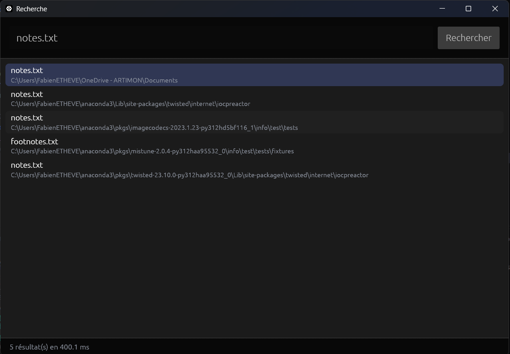

# Finder

Un moteur de recherche de fichiers pour Windows, écrit en Rust, avec une interface graphique.

C'est un projet d'apprentissage : je débute en Rust, et je voulais m'attaquer à un problème concret, la lenteur de la recherche de fichiers dans l'Explorateur Windows.



## Résultats

Recherche d'un fichier par son nom sur tout le disque `C:`, sur ma machine :

| Outil | Temps |
|---|---|
| Explorateur Windows (dossier non indexé) | plus d'une minute |
| Finder, indexation au lancement | 4.5 s |
| Finder, chaque recherche | 400 ms (build debug, non optimisé) |

Ces mesures ne valent que pour ce cas précis. Quand l'index Windows couvre le dossier, l'Explorateur est bien plus rapide, et il sait aussi chercher dans le contenu des fichiers.

## Fonctionnement

1. Au lancement, l'application parcourt le disque une seule fois, dans un thread séparé pour que la fenêtre reste fluide.
2. Elle construit un index en mémoire : une table `nom de fichier -> chemins`.
3. Chaque recherche interroge cet index, sans relire le disque.

Certains dossiers sont ignorés pendant le parcours, parce qu'ils sont volumineux et rarement utiles : dossiers système de Windows, `node_modules`, `target`, `.git`, `AppData`, etc. La liste se trouve dans `should_visit`, dans `src/search.rs`.

## Utilisation

- Tape un nom de fichier, puis **Entrée** ou le bouton **Rechercher**.
- Un texte simple cherche les fichiers dont le nom le contient : `rapport` trouve `rapport_final.pdf`.
- Les caractères `*`, `?`, `[` ou `{` activent une recherche par motif : `*.pdf`, `facture_202?.xlsx`.
- La recherche ne tient pas compte des majuscules.
- **Flèches haut/bas** pour choisir un résultat, **Entrée** ou **double-clic** pour l'ouvrir.

## Installation

Prérequis : Windows et Rust 1.95 ou plus récent (version minimale demandée par `eframe` 0.36).

```
rustup update stable
git clone <url-du-depot>
cd finder
cargo run --release
```

Le mode `--release` est fortement conseillé : sans lui, l'indexation et la recherche sont nettement plus lentes.

## Structure

```
src/
  main.rs     interface graphique (egui / eframe)
  search.rs   indexation du disque et recherche
```

## Limites

- L'index est reconstruit à chaque lancement : il n'est pas sauvegardé sur le disque.
- La recherche porte uniquement sur les noms de fichiers, pas sur leur contenu.
- Un fichier créé après l'indexation n'apparaît qu'après un redémarrage de l'application.

## Pistes d'amélioration

- Sauvegarder l'index sur le disque pour un démarrage instantané.
- Accès direct à l'index pour les recherches par nom exact.
- Lire directement la table des fichiers NTFS (MFT), comme le fait Everything, pour indexer tout un disque en quelques secondes.
- Surveiller les changements du disque pour garder l'index à jour.

## Retours

Je débute en Rust : toute remarque sur le code est la bienvenue, via une issue ou en message.